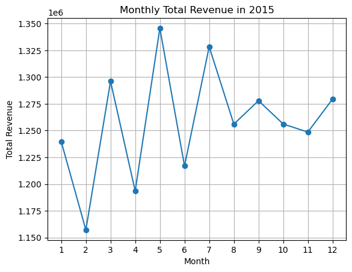
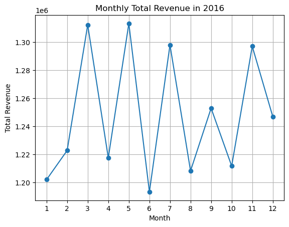
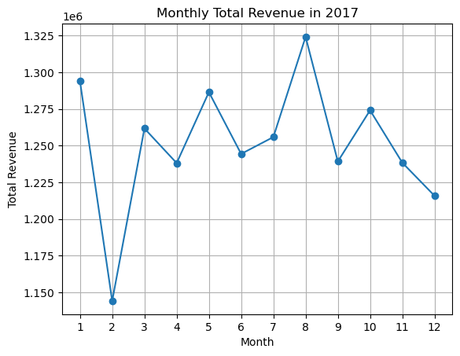
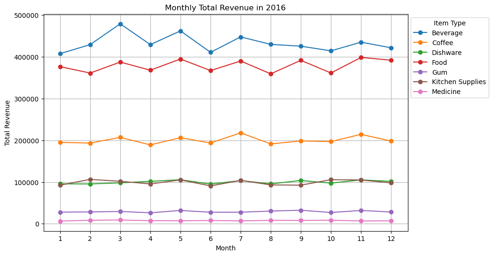
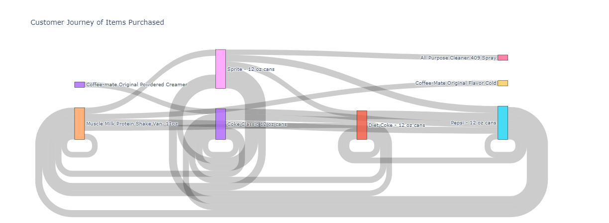
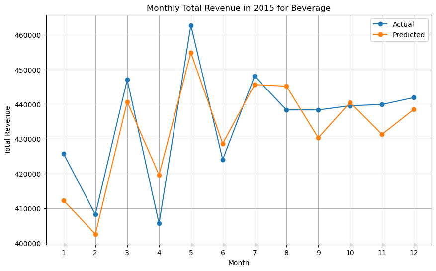

# deloitte-case-study
Proposing recommendations to Deloitte practitioners, boosting revenue and cutting losses through Demand Forecasting models.

## Dataset
Each team was given the same ECommerce dataset for the case study, containing 6 different data tables.
* customer_dim.csv - Contains data about each unique customer that has purchased from a store.
* item_dim.csv - Data about each item offered in all stores.
* store_dim.csv - Data about each store location.
* time_dim.csv - Data about the time of each transaction, down to the minute.
* trans_dim.csv - Data about all banks used by customers.
* fact_table.csv - A table of all keys from the other 5 data tables, each row representing a transaction.

## EDA

  
Found that significant low-point in sales always occurs during February, and peaks tend to happen between the months of August and December.
  
Found that month-to-month fluctuations were different for different item types.
  
Also considered product bundling as a business recommendation, showing common customer journeys through different products.

## Solution and Results
Developed three regression models, all with similar performance to predict month-to-month demands of different product types.
**Features:**
* Month (Categorical)
* Product Category
**Models:**
* Decision Tree Regressor: **R2: 0.97**
* XGBoost: **R2: 0.97**
* Long Short-Term Memory (NN): **R2: 0.99**

